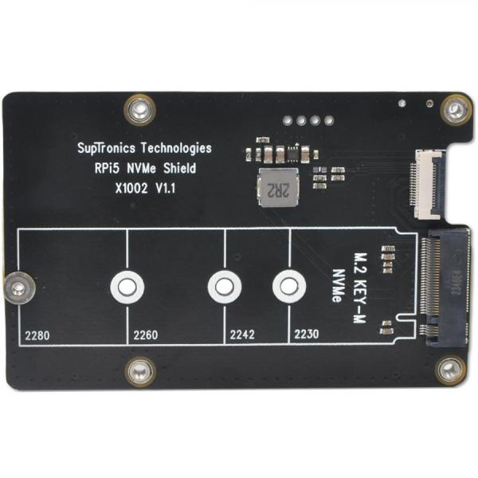
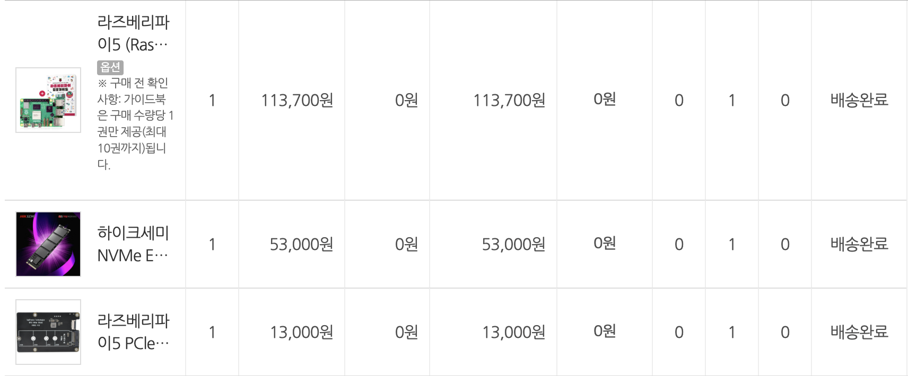
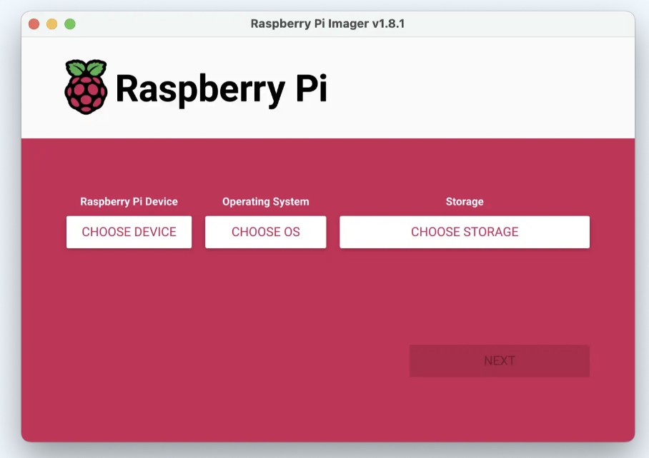
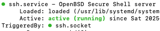
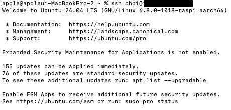
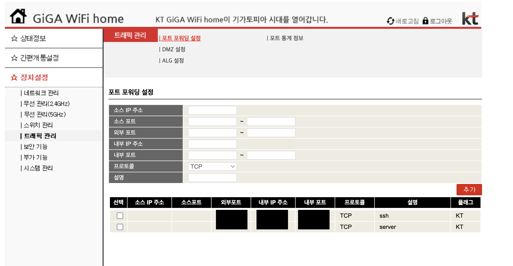
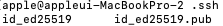

# 라즈베리파이5로 홈서버 만들기
24/7/365 가동하는 라즈베리파이5 웹서버 만들기 

## 개요
기존 삼성 SW아카데미 팀프로젝트에서 지급받던 AWS EC2(t2.xLarge)를 반납하여 AWS freetier t2.micro를 사용하다가 적은 ssd로 인하여 리팩토링, 토이 프로젝트 개발이 불가능하다고 판단하여 개발하고자합니다.

프로젝트의 READ ME는 하드웨어 측면과 소프트웨어 측면으로 나누어 작성합니다.

## 문제 정의 


기존 삼성 SW 아카데미에서 지급받은 AWS EC2 서버 스펙입니다.


기존 프로젝트 리팩토링과 토이프로젝트를 진행하기 위해 무료로 사용할 수 있는 free tier의 스펙입니다. 

30기가라는 저장용량과 일정 크레딧을 넘어갔을 때 비용이 청구되기 때문에 안정적으로 서버를 운영할 수 없다고 판단하여 개발을 시작합니다.


## 하드웨어 측면
### RasberryPi vs Intel N100
일반적으로 집에서 사용하는 홈서버는 라즈베리파이와 intel N100 두 가지로 나누어지지만 완본체인 
    1. Intel N100은 20만원대 중반(RAM 8g, SSD 256g 기준)
    2. RasberryPi5는 10만원대 초반 (RAM 8g 기준)

RasberryPi5에 저장장치를 연결하여 공학적인 측면으로 개발해보고자 선택하게 되었습니다.
추가적으로 일반적인 AWS에 사용중인 Devian 시스템에 포함된 apt(Advanced Package Tool)을 하나씩 설치해가며 각 프로그램들이 어떤 역할을 위해서 사용하는지 학습하고자하였습니다.

실제로 RasberryPi5는 기존 RasberryPi4와 달리 micro SD칩이 아닌 SSD를 장착할 수 있었습니다. 

### NVME, SATA

NVMe PCIe 3.0 SSD read 속도는 최대 약 3500MB/s, PCIe 4.0 SSD는 최대 7500MB/s에 달하는 반면, SATA SSD는 약 500~550MB/s 정도의 전송 속도에 달합니다. (Kingston Technology 발췌) NAS 보다는 실시간 요청과 웹서버의 목적이었기 때문에 read/write 속도가 높은 NVME SSD 512g로 결정하였습니다.


칩셋에 SSD를 PCIe 연결하여 512 NVME SSD를 부착하였습니다.





## 소프트웨어측면
OS: Ubuntu 24.04 LTS 버전으로 개발을 진행하였습니다.


### SSH 접속

모니터로 관리하면 개발생산성은 높아지지만 본연의 비용을 최소화하자는 목적에 위배되기때문에 ssh연결하여 사용하기로 결정하였습니다.
라즈베리파이는 기본적으로 ssh를 지원하지 않아 라즈베리파이에 접속하여 apt에서 open ssh server을 설치하고 실행하였습니다.

같은 네트워크를 사용하여 ssh로 접속하는 방식

```
sudo apt install openssh-server
```
```
sudo systemctl start ssh
```

```
sudo systemctl status ssh
```

ssh active 설정
```
 ssh rasberrypi_device_name@rasberrypi_device_ip   
``` 


**같은 네트워크를 사용중일 때 ssh 접근을 완료하였습니다.**
***
### 같은 subnet의 한계 
AWS와 같은 클라우드 컴퓨터의 장점은 언제 어디에서나 접속을 할 수 있다는 점입니다. 하지만 위와 같이 개발한다면 외부 IP에서 ssh 접근하는 경우 NAT에서 접근이 막혀 ssh 접속요청들이 중간에서 유실되게 되어 EC2 인스턴스처럼 사용할 수 없다는 한계가 존재합니다.

따라서 외부에서 SSH 요청을 라우터에서 포트포워딩 할 수 있게 하여 외부에서 접근하는 ssh 요청을 라즈베리파이까지 보내야합니다.

#### 포트포워딩
현재 사용하고 있는 KT사의 인터넷을 사용하고 있고 KT 라우터에 직접 접근하여 해결하였습니다.
```
현재 사용하고 있는 KT 라우터에 대한 설정 127.30.1.254(모두 동일)
```

KT사가 지원하는 ip에 접근하여 사용하고자 하는 포트 포워딩 설정을 해줍니다.


위와 같이 설정하면 아래 명령어를 통하여 ssh로 외부에서 접근할 수 있게 됩니다.
```
ssh -p port_num rasberrypi_device_name@rasberrypi_device_ip
```
**다른 네트워크를 사용중일 때 ssh 접근을 완료하였습니다,**
***
### 보안적 측면
#### SSH 키 기반 인증 
지금까지의 방법으로 끝나게 된다면 아래와 같은 요소들만 알게된다면 누구나 쉽게 접근한다는 한계가 존재합니다.  
- 라즈베리파이 네트워크 ip
- 포트 번호
- 라즈베리파이 이름
- 라즈베리파이 비밀번호

따라서 내가 나임을 인지할 수 있는 무언가를 통하여 접속을 하게끔 설정해야만합니다.

이를 해결하기 위해 비밀번호 대신 개인키/공개키를 사용하여 인증을 통해서만 접속할 수 있도록 설정하였습니다. 

맥북에 AWS pem키와 유사하게 **비대칭 암호화 방식** SSH 키 페어를 생성합니다. 
```
ssh-keygen -t ed25519 -C "My_Email"
```

이메일로 개인키를 생성하였고 .pub이라는 공개키가 동시에 생성됩니다. 
이 공개키를 라즈베라파이의 authorized_keys에 복사하여 공개키에 맞는 개인키를 가진 디바이스에서만 접속할 수 있도록 설정하였습니다.

#### 방화벽
불필요한 포트를 전부 차단하고 ssh를 허용한 포트만 열어두는 방식으로 보안을 강화하였습니다.
```
sudo ufw allow port_num/tcp or udp 
```
#### Bruteforce Attack (무차별 대입 공격)
키가 없어도 ssh 자체의 접근을 방지할 순 없어 안전하게 apt의 Fail2ban을 설치하여 보안을 강화하였습니다.
기본 설정 **jail.conf**에서 반복적인 로그인 실패가 감지되면 IP를 차단해주기 떄문에 추가적인 설정은 따로 진행하지 않았습니다.
```
sudo apt install fail2ban
```

***
### CPU 사용량, 온도, 메모리 사용량 알림
모니터를 연결하지 않은 상태에서 웹 서버로의 용도로 사용하고 있어 cpu의 사용량과 온도, 메모리 사용량이 일정 임계치를 넘어선다면 조치를 취할 수 있는 방안이 필요했습니다.

쉘스크립트를 작성하여 시작프로그램처럼 사용하여 임계치에 도달한 부분을 개인 이메일로 받을 수 있게 구현하면 모니터 없이도 조치가 가능할 거라고 판단하였습니다.
작성한 스크립트의 시나리오는 다음과 같습니다.
```
60초 마다 CPU 사용률, 메모리 사용률, CPU온도가 각각의 임계치를 초과하면 5번의 지속적인 체크를 통해 조치를 취해야하는 지 판단하고
조건에 만족할 경우 한 번만 이메일 알림을 보냅니다.
```
```
#!/bin/bash
LOG_FILE="/tmp/alert_monitor.log"

log_msg() {
    echo "$(date '+%Y-%m-%d %H:%M:%S') $1" >> "$LOG_FILE"
}

CPU_THRESHOLD=90
MEM_THRESHOLD=90
TEMP_THRESHOLD=85
REQUIRED_CHECKS=5
RECIPIENT="choi's_email"
MAIL_SENT_FLAG="/tmp/alert_mail_sent"
consecutive_checks=0

get_cpu_usage() {
    usage=$(top -bn1 | grep "Cpu(s)" | awk '{print 100 - $8}' | cut -d'.' -f1)
    echo $usage
}

get_mem_usage() {
    read used total < <(free | awk '/^Mem:/ {print $3, $2}')
    percent=$(awk "BEGIN {printf \"%d\", ($used/$total)*100}")
    echo $percent
}

get_cpu_temp() {
    temp=$(vcgencmd measure_temp | cut -d'=' -f2 | cut -d"'" -f1)
    echo ${temp%.*}
}

log_msg "start monitoring"

while true; do
    cpu_usage=$(get_cpu_usage)
    mem_usage=$(get_mem_usage)
    cpu_temp=$(get_cpu_temp)

    log_msg "현재 상태 - CPU: ${cpu_usage}%, 메모리: ${mem_usage}%, 온도: ${cpu_temp}°C"

    if [ "$cpu_usage" -ge "$CPU_THRESHOLD" ] && [ "$mem_usage" -ge "$MEM_THRESHOLD" ] && [ "$cpu_temp" -ge "$TEMP_THRESHOLD" ]; then
        consecutive_checks=$((consecutive_checks + 1))
        log_msg "check ${consecutive_checks}/${REQUIRED_CHECKS}"
    else
        consecutive_checks=0
    fi

    if [ "$consecutive_checks" -ge "$REQUIRED_CHECKS" ]; then
        if [ ! -f "$MAIL_SENT_FLAG" ]; then
            subject="CPU/메모리/온도 임계치 초과"
            body="지속적 임계치 초과
CPU 사용률: ${cpu_usage}%
메모리 사용률: ${mem_usage}%
CPU 온도: ${cpu_temp}°C"
            echo -e "$body" | mail -s "$subject" "$RECIPIENT"
            touch "$MAIL_SENT_FLAG"
            log_msg "mail send."
        else
            log_msg "already sended"
        fi
    fi

    sleep 60
done
```
***
## 결론 
### 개인적 측면
- 아무것도 설치되어 있지 않는 SSD, RasberryPi 칩셋을 필요한 apt의 프로그램들을 설치하는 과정에서 AWS가 일반적으로 지원하는 부분과의 차이점을 느꼈고 비용 측면(나의 돈)에서 고려해야하니 최적화를 위해서 많은 고민과 선택들이 있던 프로젝트였습니다.
- NAT, 공유기, subnet, bruteforce attack 등 네트워크 지식을 실질적으로 유용하게 프로젝트에 적용해볼 수 있는 점에서 개인적인 발전이 있었습니다.
### 비용적 측면 
- 기존에 팀에 발급받던 t2.xlarge 스펙의 인스턴스의 비용: 시간당 0.1856 USD(한화 약 269.32원)
- Rasberry Pi 5비용: 최대 전력 소비량 15W * 전기요금 121.32원(가정용 전기 기준) = 시간당 1.82원 
- 유지비 관점에서 시간당 269.32원 사용해야 했던 부분을 1.82원으로 최적화 시킬 수 있었습니다.